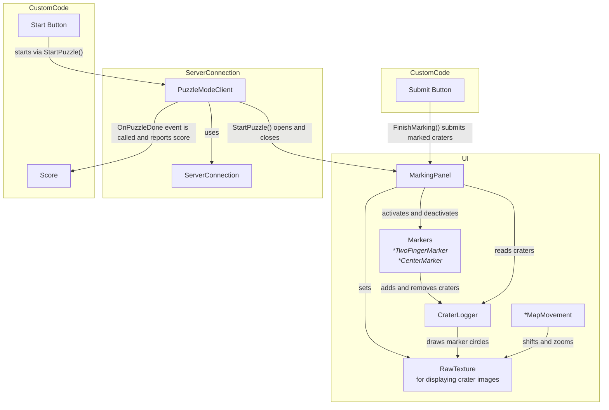

# Image Annotation
A package to annotate Images for the ESA Moon Lander Project. This Package provides functions to interface with the Server and multiple example Marking Techniques, like Maps Like Marking and Two Finger Marking
## Installation
### 1. Prerequisites
#### [Naughty Attributes](https://github.com/dbrizov/NaughtyAttributes)
This package depends on the Naughty Attributes package. Please make sure to install it beforehand:
Go to the Unity Package Manager and click the `➕` Sign in the top left corner to "Add from git URL" then paste the following Link:
`https://github.com/dbrizov/NaughtyAttributes.git#upm`

### 2. Package Installation
Go to the Unity Package Manager and click the `➕` Sign in the top left corner to "Add from git URL" then paste the following Link:
`https://github.com/littleBugHunter/esa-gamification-unity.git#upm`

## Samples
The Package comes with Samples that can be selected from the Unity Package Manager. In the Samples you will find example Setups for the different Marking Setups along with Prefabs.
The Example Scenes can be found in: `Assets/Samples/Annotation/Scenes`

## Component Setup Diagram
